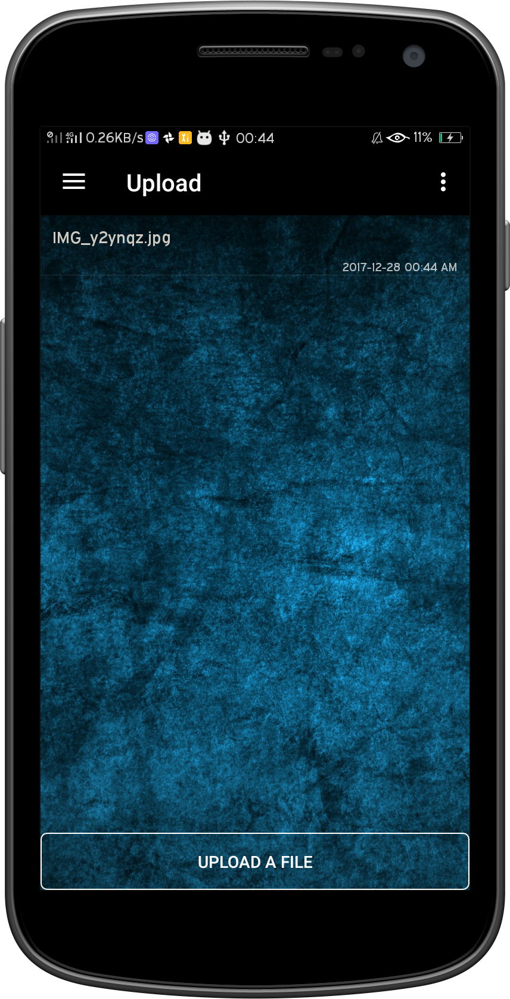

# Android_ConvolutionCampusAmbassadorApp

<a href="https://www.youtube.com/watch?v=ze4Xov_Nc5Y">Watch me explain how this app works!!</a>
<ul>
  <li>This Application is a step forward in accordance with the Digital India campaign.</li>
  <li>Facilitates online communication between Campus Ambassador and the organizing council.</li>
  <li>Application was used by more than 100 assigned Campus Ambassadors.</li>
  <li>Functionality of generating registration, accommodation form, event information, event handbooks, notifications, general information was provided and could be accessed with just one click.</li>
  <li>Main Feature – Leaderboard, provided ranking of Campus Ambassadors based on number of registration and hence promoting sense of competition, which benefitted in generating more registrations.</li>
  <li>Registration developed and designed to handle one to four registration at same time.</li>
  <li>Upload section helped Campus Ambassadors to upload weekly reports of task allocated.</li>
  <li>Download section, gave Campus Ambassadors with all required paperwork and information regarding the event.</li>
   <li>Firebase was used to provide upload, download, leaderboard, functionality by using real time database, and cloud storage.</li>
   <li>Dashboard, provided list of all events and registered participants.</li>
   <li>Data was stored in MySQL database and was fetched using REST APIs developed in php on backend.</li>
  <li>This application focused on creating a digital communication between organizing committee, Campus Ambassadors and Students.</li>
 </ul>
 

 
 

  
  
  
  
  
  
  
  

